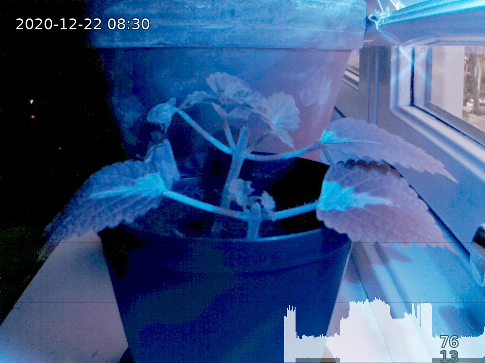

# About

Capture photos with a [Raspberry Pi](https://www.raspberrypi.org/) and make a [Timelapse](https://en.wikipedia.org/wiki/Time-lapse_photography).



## Quick start

```bash
$ ls -1 -A images
still_20201226_100003.png
still_20201226_101003.png
still_20201226_102004.png
still_20201226_103004.png
still_20201226_104004.png
still_20201226_105004.png
$ python post_process.py 'images/*.png'
images/still_20201226_100003.png => output/still_20201226_100003.jpg
images/still_20201226_101003.png => output/still_20201226_101003.jpg
images/still_20201226_102004.png => output/still_20201226_102004.jpg
images/still_20201226_103004.png => output/still_20201226_103004.jpg
images/still_20201226_104004.png => output/still_20201226_104004.jpg
images/still_20201226_105004.png => output/still_20201226_105004.jpg
$ ./pimelapse.sh 2> /dev/null
```
